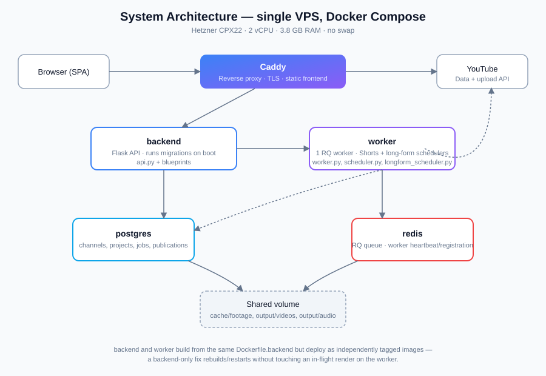
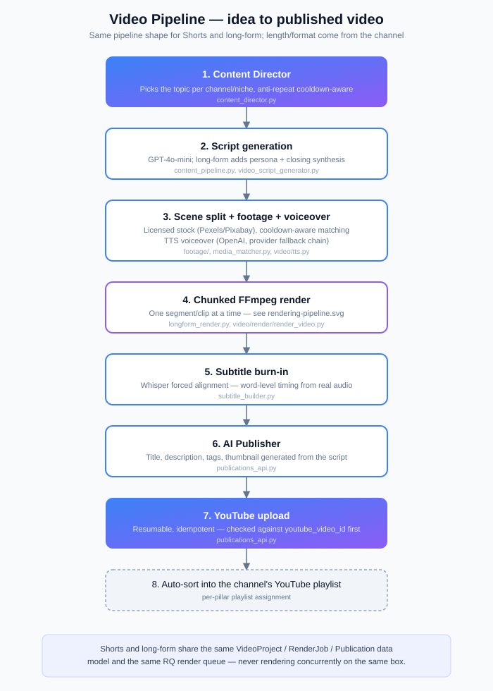

# Architecture

This document maps the system as it actually runs today. For *why* it's built this
way, see [`SYSTEM_DESIGN.md`](SYSTEM_DESIGN.md) and
[`ENGINEERING_DECISIONS.md`](ENGINEERING_DECISIONS.md).

## Runtime topology



Five Docker Compose services on a single VPS (Hetzner CPX22 — 2 vCPU, 3.8 GB RAM,
no swap):

| Service | Role |
|---|---|
| `backend` | Flask API (`app.py` + blueprints). Serves the frontend and every `/api/*` route. Runs migrations on boot. |
| `worker` | Single RQ worker consuming the `generation` and `render` queues, plus two in-process background schedulers (Shorts factory, long-form). |
| `postgres` | System of record — channels, projects, scenes, render jobs, publications. |
| `redis` | RQ job queue + worker heartbeat/registration. |
| `caddy` | Reverse proxy, TLS termination, static frontend serving. |

`backend` and `worker` build from the same `Dockerfile.backend` but are tagged as
independent images — a backend-only code change rebuilds and restarts in seconds
without touching an in-flight render on the worker.

## Backend module map

| Area | Files |
|---|---|
| App bootstrap | `app.py` — Flask factory, blueprint registration, migration trigger, niche-catalog seeding |
| Auth | `auth.py` (email code + Google/Facebook OAuth), session tokens |
| Data model | `app_models.py` (SQLAlchemy ORM — `AppUser`, `Channel`, `VideoProject`, `VideoScene`, `RenderJob`, `Publication`, …) |
| Route surface | `api.py` (auth, legacy content), `channels_api.py`, `video_projects_api.py`, `publications_api.py`, `factory_dashboard_api.py`, `content_director_api.py` |
| Content generation | `content_pipeline.py` (short-form text), `video_script_generator.py` (script + long-form narration), `content_director.py` (topic selection, anti-repeat) |
| Media selection | `footage/` (Pexels/Pixabay providers, ranking, shot types), `media_matcher.py`, `media_query_builder.py`, `image_picker.py` |
| Voice | `video/tts.py` — OpenAI TTS with a provider fallback chain |
| Rendering | `video/render/render_video.py` (Shorts), `longform_render.py` + `longform_pipeline.py` (long-form, chunked/memory-safe), `longform_cards.py` (branded overlay cards), `subtitle_builder.py` |
| Publishing | `publications_api.py` — resumable YouTube upload, idempotency guard, playlist sorting |
| Scheduling | `scheduler.py` (Shorts: daily quota, publish window, row-locked reservation, self-healing stuck-job detection), `longform_scheduler.py` (long-form: separate daily cadence) |
| Ops/health | `factory_dashboard_api.py` — real infra checks (DB/Redis/worker/FFmpeg/disk/queues), never a faked status |
| Billing (legacy) | `plans_catalog.py`, `services/entitlements.py`, `stripe_service.py` — see [Legacy surfaces](#legacy-surfaces-kept-intentionally) |

## Frontend

Vanilla JS SPA — `frontend/app.js` (one file, client-side router, all page
renderers) plus a per-route static HTML shell (`frontend/<page>/index.html`) so
each route has its own `<title>`/meta tags. No build step, no framework.
`frontend/operations.js` is a deliberately separate, standalone module (see
[Legacy surfaces](#legacy-surfaces-kept-intentionally)).

## Generation pipeline (the actual path a video takes)



```
Content Director (topic, anti-repeat)
        │
        ▼
Script generation (GPT-4o-mini; long-form gets a persona + closing synthesis)
        │
        ▼
Scene split → footage matching (licensed stock, cooldown-aware) → TTS voiceover
        │
        ▼
Chunked FFmpeg render (one segment/clip at a time — see SYSTEM_DESIGN.md)
        │
        ▼
Subtitle burn-in (Whisper forced alignment — word-level timing from real audio)
        │
        ▼
AI Publisher (title/description/tags/thumbnail) → YouTube upload (resumable, idempotent)
        │
        ▼
Auto-sort into the channel's YouTube playlist
```

Both the Shorts factory and the long-form pipeline converge on the same
`VideoProject` / `RenderJob` / `Publication` data model and the same RQ `render`
queue, so they're never rendering concurrently on the same box.

## Legacy surfaces (kept intentionally)

The product's scope evolved from an earlier social-media posting tool into
today's YouTube video factory. Two things from that earlier era are still present,
on purpose, not by oversight:

- **`plans_catalog.py` / `stripe_service.py` / Facebook posting (`facebook_api.py`,
  `gpt_generator.py`)** — real, working code, reachable from a secondary
  "Social content tools" section of the UI, not deleted because it's still
  occasionally used and deleting working code without a replacement isn't a
  responsible call to make unilaterally.
- **`deploy/release/`** — a frozen snapshot of a prior release, kept as a
  reference point, not part of the active runtime (`app.py` never imports from it).

## What's deliberately *not* here

- No message broker beyond Redis/RQ — the job volume (tens of jobs/day) doesn't
  justify Kafka/SQS-class infrastructure.
- No Kubernetes — one VPS, five containers, Docker Compose. Right-sized for the
  current scale; see [`SYSTEM_DESIGN.md`](SYSTEM_DESIGN.md) for the reasoning.
- No frontend build pipeline — a deliberate simplicity trade-off, discussed
  honestly in [`ENGINEERING_DECISIONS.md`](ENGINEERING_DECISIONS.md).
