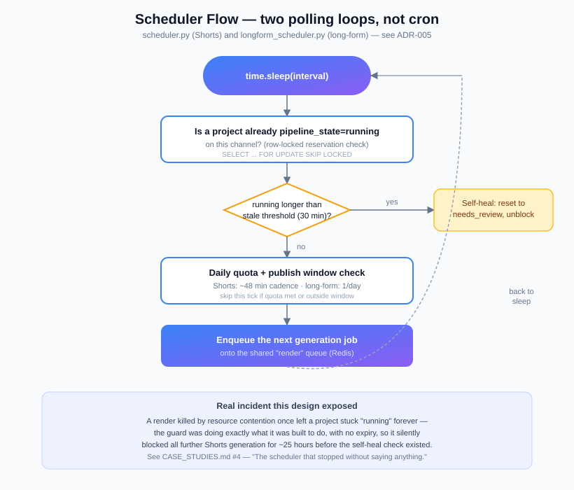

# Operations

## The Operations dashboard

`/operations` — a standalone frontend module (`frontend/operations.js`), built
separately from the main SPA file rather than inside it; see
[`ENGINEERING_DECISIONS.md`](ENGINEERING_DECISIONS.md) for why. Backed entirely
by `GET /api/factory-dashboard` and `GET /api/readiness` — no client-side
derivation of health state, no fabricated values.

Shows: backend/database/Redis/RQ-worker/FFmpeg/disk health (each one
`Healthy`/`Degraded`/`Offline`/**`Unknown`** — a value the backend genuinely
can't read is shown as `Unknown`, never defaulted to green), render-queue
length, running/pending/failed job counts, short/long video counts, recent
errors (each linking to where to actually fix it), and recent publications.
Includes a loading skeleton, an error state with retry, a manual refresh, and a
last-updated timestamp.

## Runbook: "Worker shows Offline"

1. Check `docker inspect --format='{{.RestartCount}}' autosocial-worker-1` — if
   it's actually restarting in a loop, that's the real problem; go to the crash
   logs, not the health check.
2. If the container is stable (0 restarts, uptime looks right), this was very
   likely the exact false-positive documented in
   [`CASE_STUDIES.md`](CASE_STUDIES.md#2-the-worker-was-never-offline) — check
   the deployed `factory_dashboard_api.py` actually has the `online =
   bool(Worker.all(...))` fix, not the old 120-second heartbeat-age check.
3. To confirm the worker is genuinely alive regardless of what the endpoint
   says: `docker exec autosocial-worker-1 python -c "from redis import Redis;
   from rq import Worker; from saas_settings import settings; print(len(Worker.all(connection=Redis.from_url(settings.REDIS_URL))))"`
   — `0` means genuinely offline; `1` means it's registered and RQ itself
   still considers it alive.

## Runbook: "Shorts stopped generating, no errors visible"



This has a known, previously-real cause: a render killed mid-job (OOM, restart)
can leave a `VideoProject.pipeline_state="running"` forever, and the scheduler
refuses to start a new job on a channel that already has one "running" — so
generation silently stops, with no exception thrown anywhere (nothing is
actually failing; the scheduler is correctly waiting on a job that will never
finish).

1. Check for a project stuck in `pipeline_state="running"` for far longer than
   a real render takes.
2. As of the self-heal fix, the scheduler resets anything stuck past
   `FACTORY_RUNNING_STALE_MIN` (default 30 minutes) automatically — if this is
   still happening, check that env var is actually set and the scheduler
   process is the current build.
3. Manual unblock if needed: set the stuck project's `pipeline_state` to
   `needs_review`.

## Runbook: "A render failed"

Failed `RenderJob` rows carry a real, human-readable `error` (never just an
exit code) — e.g. `ffmpeg_failed: ...`, `Task exceeded maximum timeout value
(1800 seconds)`, `scenes_missing_media: scenes [...] have no attached media
file`. The dashboard surfaces these directly with a link to the affected
project. Retry is only offered where the underlying state actually allows a
safe retry (never on a project mid-upload, to avoid a duplicate YouTube
publish).

## Safety rails that exist specifically to prevent bad outcomes

- **No duplicate publish, ever.** The publish path checks for an existing
  `youtube_video_id` on the project before starting an upload — this is
  checked, not assumed, as part of every deploy's verification pass.
- **No accidental mass-generation.** Manual test/debug actions are never run
  against the live scheduler path; verifying a fix uses the smallest safe
  surface available (a targeted unit test, a single cheap frame render) rather
  than triggering a real production render "just to check."
- **Long-form renders never contend with Shorts for memory.** Both pipelines
  share the same single RQ `render` queue on purpose — see
  [`SYSTEM_DESIGN.md`](SYSTEM_DESIGN.md).

## Logs

```bash
docker logs --since 20m autosocial-backend-1
docker logs --since 20m autosocial-worker-1
```

Checked after every deploy for `traceback`/`exception`/`error`/`critical`,
explicitly excluding known-benign startup lines (e.g. the OAuth config
self-check that always prints at boot).
