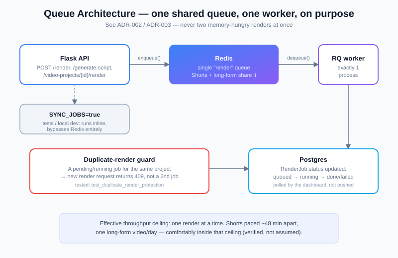
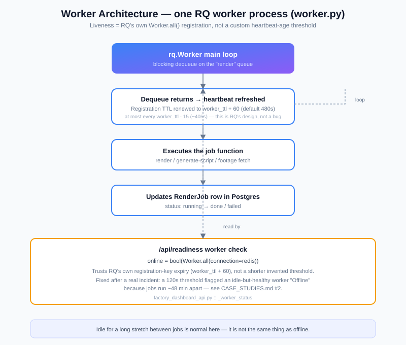

# Performance & Reliability

How this system behaves under load, what happens when a step fails, and what
"healthy" actually means here. This is an index into mechanisms that live in
several files — each section points at the real code, not a restatement of
it. For *why* these choices were made, see [`docs/adr/`](docs/adr/) and
[`SYSTEM_DESIGN.md`](SYSTEM_DESIGN.md).

## Queues and worker

- One Redis-backed queue (`render`), one RQ worker process (`worker.py`).
  Shorts and long-form jobs share the same queue by design — see
  [ADR-002](docs/adr/002-why-redis-queue.md) — so two memory-hungry renders
  can never run concurrently on a 3.8 GB box.
- Effective throughput ceiling: one render at a time. Measured pacing is
  Shorts every ~48 minutes plus one long-form render/day, comfortably inside
  that ceiling (verified directly, not assumed — see
  [`DEPLOYMENT.md`](DEPLOYMENT.md) for how a real deploy was verified against
  live timing).
- `SYNC_JOBS=true` runs jobs inline instead of via Redis/RQ — used by the
  test suite and local dev so neither needs Redis running.

## Scaling

- Current ceiling is one worker process, by design, not by accident of not
  scaling up yet. Adding a second worker on the *same* queue would break the
  "never overlap" memory guarantee; scaling render throughput would mean
  either a second, independent VPS with its own worker and queue namespace,
  or moving to a larger instance and accepting a higher OOM-risk ceiling
  before adding concurrency. Neither has been necessary yet — see
  [`PRODUCTION.md`](PRODUCTION.md) for current real output volume.
- The API and Postgres/Redis layers are not the bottleneck at current volume;
  no load testing has been done against them because the system has never
  been anywhere near that ceiling. Stated as a known gap, not a hidden one.

## Retry and idempotency

- **Render jobs are not silently retried.** A failed render surfaces as
  `failed` on the dashboard with the real error (see
  [`OPERATIONS.md`](OPERATIONS.md) runbook: "A render failed") rather than
  auto-retrying and potentially burning render time/API cost on a
  deterministic failure (e.g. no matching footage for a scene).
- **Media/footage selection deliberately avoids retry-based dedup.** Per
  project convention (see `AGENTS.md`), repeated-media handling uses
  deterministic de-duplication (cooldowns, reservation) instead of "retry
  the random pick until it looks different" — a retry loop there would be
  slower and non-reproducible for the same inputs.
- **Duplicate-render protection is real and tested**, not just a UI
  affordance: `POST /api/video-projects/{id}/render` returns `409` if a
  render is already pending/running for that project
  (`tests/test_video_projects.py::test_duplicate_render_protection`), so a
  double-click or a retried request from the frontend can't queue two
  renders for the same project.
- **Publishing is guarded against double-publish explicitly**, not via a
  database constraint: `POST /api/video-projects/{id}/publications` checks
  for an existing active or already-`published` `Publication` row for that
  project before creating a new one, returning `409` if found
  (`publications_api.py`) — the class of bug this architecture is most
  exposed to (publishing the same finished video twice) is checked at the
  application layer, at the moment a new publication would be created.

## Deployment and rollback

Full procedure in [`DEPLOYMENT.md`](DEPLOYMENT.md); summarized here as the
performance/reliability-relevant parts:

- Deploys are gated on the full test suite passing and an in-flight-job
  check (never deploy over a running render).
- Every deploy records `.prev_release_commit`; `scripts/rollback.sh` checks
  out that commit and restarts, with a post-rollback health check that must
  pass before the rollback is considered complete.
- Migrations are additive-only in the current schema history — a rollback
  never needs a destructive down-migration, only a code checkout.

## Health vs. readiness

Two distinct endpoints, deliberately not conflated:

- **`GET /api/health`** — public, unauthenticated, cheap. Answers "is the
  process up and serving requests," used by the reverse proxy / uptime
  checks. No dependency checks.
- **`GET /api/readiness`** — authenticated, detailed. Checks database
  connectivity, `PRIVATE_ADMIN_MODE` config sanity, encryption key presence,
  Redis reachability, RQ worker liveness, FFmpeg/ffprobe binary presence,
  and output-directory writability — each flagged `critical` or not,
  because a missing Redis connection should degrade rendering, not report
  the whole app as down. Backs the Operations dashboard's infrastructure
  panel (`frontend/operations.js`), not just a boolean.
- Worker liveness specifically is derived from RQ's own registration state
  (`Worker.all()`), not a custom heartbeat-age threshold — the previous
  threshold-based check produced false "offline" alerts because it was
  stricter than RQ's own liveness window; see
  [`CASE_STUDIES.md` #2](CASE_STUDIES.md#2-the-worker-was-never-offline).
