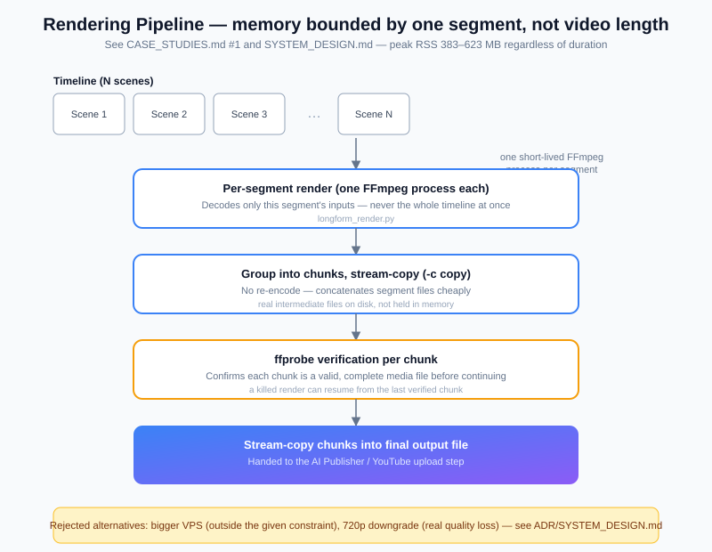

# System Design

The single hardest constraint on this system: **it renders 1080p video, including
long-form (8–12 minute) video, on a 3.8 GB RAM VPS with no swap.** Almost every
non-obvious design choice in the render path traces back to that one number.

## The constraint

- Host: Hetzner CPX22 — 2 vCPU, 3.8 GB RAM, no swap configured.
- Workload: ~20 short videos/day + 1 long-form video/day, fully automated, on a
  live YouTube channel — a render failure isn't a test failure, it's a missed
  publish on a real schedule.
- No budget assumption to "just upgrade the box" — the design had to work within
  the constraint, not around it.

## Why a naive render doesn't work here

The obvious approach — build one `ffmpeg` `filter_complex` graph over every clip
in the video and encode once — decodes every input clip into memory
simultaneously. For an 8–12 minute video assembled from 15–20 clips/photos, that
graph OOM-killed the process at roughly 40% progress on this box. This isn't a
tuning problem; it scales with video length, so it was always going to fail past
some duration, deterministically.

## The fix: bound memory independent of video length

`longform_render.py` never holds more than one clip/still in memory:

1. **Per-segment render.** Each still image or clip becomes its own short FFmpeg
   process, encoding a few seconds of video. One decoded input, one encoder — peak
   memory for this step is a small, fixed footprint (~10 MB for a still,
   proportionally more for a clip), regardless of how many segments the final
   video has.
2. **Chunked concatenation.** Segments are grouped into ~30–60 s chunks and
   concatenated with `ffmpeg -c copy` (stream copy, no re-encode) — cheap, and
   each chunk is verified with `ffprobe` before being trusted.
3. **Final concatenation.** Chunks are stream-copied into the final file the same
   way.
4. **Resumability.** Every intermediate segment and chunk is a real file on disk;
   a killed/restarted render picks up from the last verified chunk instead of
   starting over.

Measured result: peak RSS 383–623 MB across multiple real production renders
(9–14 minute videos), independent of length, with zero OOM kills and zero swap
usage since the redesign. Full incident writeup, including the before/after
numbers from the actual crash, in
[`CASE_STUDIES.md`](CASE_STUDIES.md#1-memory-safe-long-form-rendering).

## Other constraint-driven decisions

- **Single RQ worker, one queue for both pipelines.** Shorts and long-form
  rendering share the same `render` queue on purpose — with only one worker
  process, this guarantees the two workloads are never CPU/memory-contending at
  the same time on the same box. The alternative (a dedicated long-form worker)
  would need a second process's worth of headroom this VPS doesn't have.
- **No swap.** Deliberately not enabled — on a box this small, once you're
  swapping a video-encoding workload you're already past the point of a good
  outcome; the render design keeps memory bounded instead of relying on swap as
  a safety net.
- **Ken Burns pans use crop, not zoom.** `zoompan`'s per-frame zoom recomputation
  produces visible sub-pixel jitter on this hardware's encode settings; a fixed
  supersampled canvas with a sliding `crop` window gives a smooth pan without the
  extra per-frame computation zoompan's zoom path requires.
- **Vertical scaling, not horizontal, for now.** At ~20 videos/day the box isn't
  CPU-bound most of the day; the design optimizes for *never OOMing* over
  *maximizing throughput*, since a missed publish matters more than an idle CPU.

## What this design explicitly does not solve

- It doesn't make the box fast — a long-form render still takes several minutes.
- It doesn't scale to many concurrent channels rendering simultaneously without
  either a bigger box or a second worker process with its own memory budget.
  Both are the correct next step if daily volume grows meaningfully past current
  levels — deliberately deferred, not missed.
